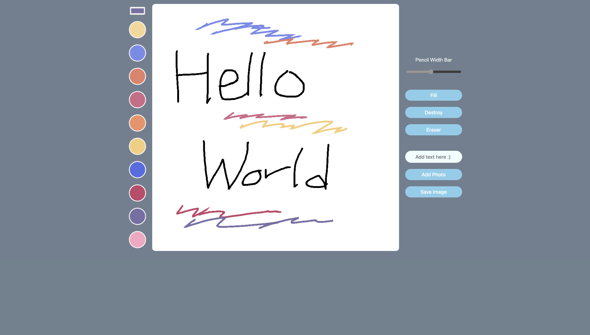

# MEME MAKER

사용자가 디지털 캔버스에 그림을 그리고, 창의력을 표현할 수 있는 웹 기반 서비스를 제공합니다. 손쉬운 조작과 다양한 기능을 통해 모든 연령층의 사용자가 즐길 수 있도록 디자인되었습니다.

## 주요 기능

- **색상 선택**: 다양한 색상을 선택할 수 있는 팔레트가 제공됩니다.

- **그리기 도구**: 펜 너비를 조절할 수 있는 슬라이더와 함께, 채우기, 지우기, 텍스트 추가 등의 기능을 사용할 수 있습니다.

- **사진 추가**: 사용자가 자신의 사진을 캔버스에 추가할 수 있는 기능을 제공합니다.

- **이미지 저장**: 사용자가 작업한 그림을 이미지 파일로 저장할 수 있는 기능입니다.

## 기술 스택

`HTML5` `CSS3` `JavaScript` `jQuery` `Bootstrap`

## 사용자 경험

이 애플리케이션은 사용자가 직관적으로 색상을 선택하고, 그리기 도구를 쉽게 사용할 수 있도록 디자인되었습니다. 사용자는 'Add text here :' 입력란에 텍스트를 추가하거나, 'Add Photo' 버튼으로 사진을 업로드할 수 있고, 'Save image'로 사진을 저장할 수 있습니다.

